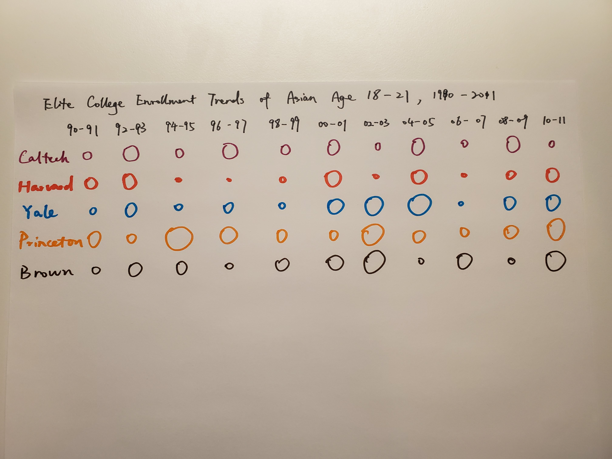
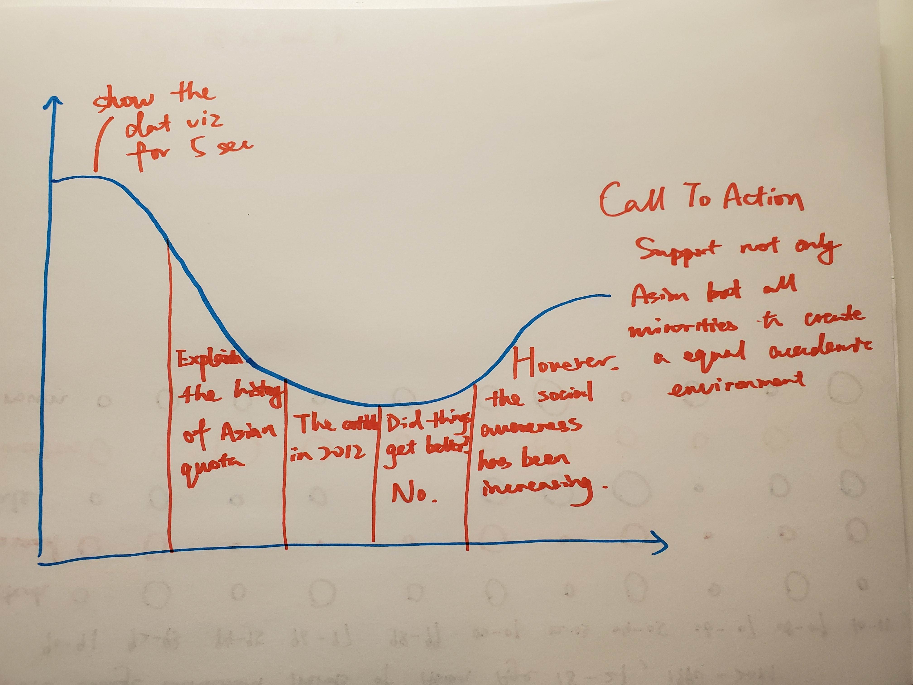

# TSWD Final Project Proposal - Asian Quota in Ivy League College Admission
## Summary

In 2012, an article wrote by Ron Uniz indicates that there is an Ivy League Asian quota. 
However, the data visualization in his article can be improved. In this project, 
I will redesign the data visualization and investigate the current condition of this issue after the article was published.

## Outline 

1. The factors behind the battle of college admission
2. The story of the battle of college admission
3. There used to be a jewish quota
4. The Asian quota
5. 2012 - An article that raised social awareness
6. The current condition

## Initial sketches

In the original data visualization, Uniz used a line chart to show the trend of Asian enrollment by Ivy League schools. 
The y-axis and the x-axis represent the percentage of Asian Student enrollment and year, respectively. 
Since there are eight schools and Uniz gave each school a unique color, the chart looks crowded. 
Also, he used another y-axis to indicate the growth of the Asian American population. 
The table looks crowded, and it takes time to interpret. 

When I was redesigning the chart, I tried to keep the information still in one visualization 
without making each category overlap each other visually. Therefore, I decided to let y-axis 
to be different universities and let x-axis to represent time. 
I will use a similar color scheme to differentiate schools and use 
the size of the circle to show the change in the percentage of Asian admission.

## The Data
The 
[National Center for Education Statistics](https://nces.ed.gov)
receives the racial enrollment data from American universities each year. 
In this publicly available website, we can find the necessary data for each university of interest. 
I will keep exploring this database to find more recent data. 
Also, I will search for data that shows the trend of the American population in different races.

[The Data in Ron Unz's Article](https://www.theamericanconservative.com/articles/meritocracy-appendices/)

## Method and Medium
For now, I am planning to use shorthand to write a story for this final project. For each element listed in the outline section, I will create a page on shorthand with a couple paragraphs of explanation and some pitures and visualiztions to increase the engagement of the audience. I will explore the use of other data visualization tools as I dive deeper into more data.

## The Story Arc

First, I will simply show the chart and let my audience process the visual information for 5 seconds. 
Each column of the circles will pop up in sequence from left to right to show the change of enrollment percentage in time.
I will use cicles to represent the data before 2012 and soild circles for data between 2013 and 2019. Moreover, I will use different gray to represent the change in U.S. population and Asian American pupulation.
I expect readers concern more as they see more data so that the story arc will slope down at the beginning.

Then I will start to explain the history of Asian quota in Ivy League, briefly introduce the article published in 2012, 
demonstrate its influence, and show my research on the current condition. I think the the audience will keep concer more 
becasue the quota still exists.

Following that, I will explain how does the media raised social awareness on this issue. The story arc should slope upward
in this section. 

Finally, my call to action would be we should support not only Asian but all minorities to create a equal academic environment.
