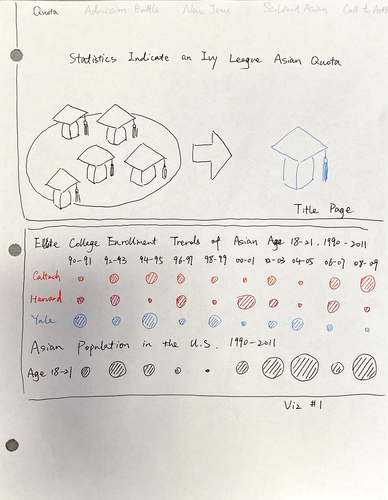
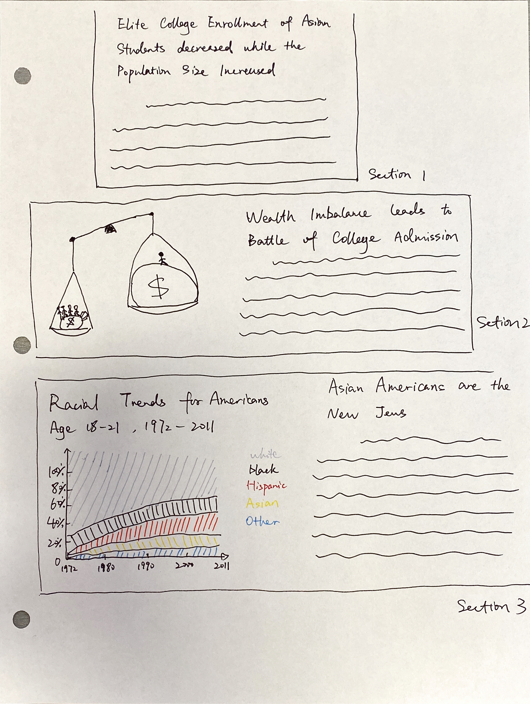
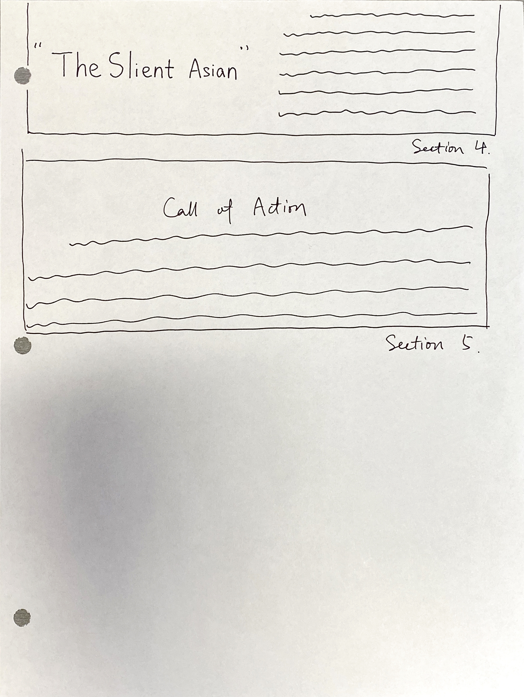
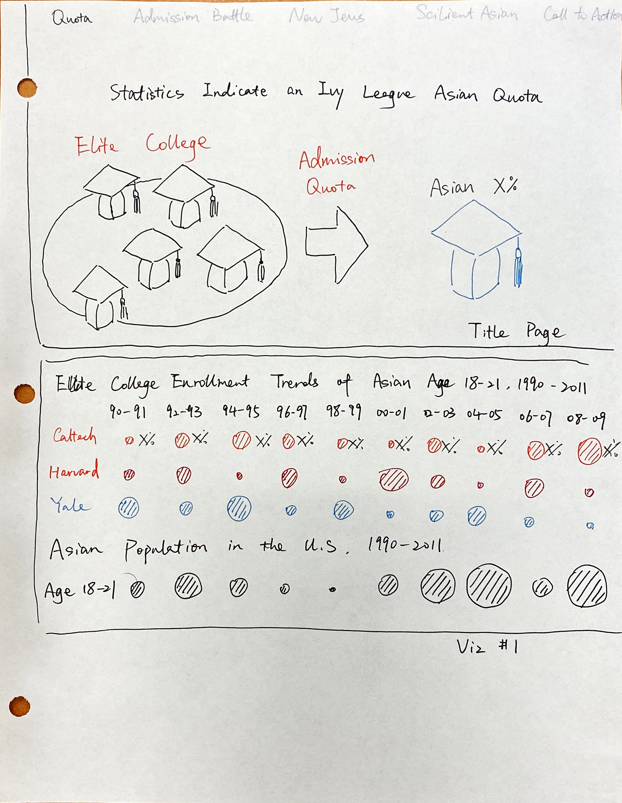
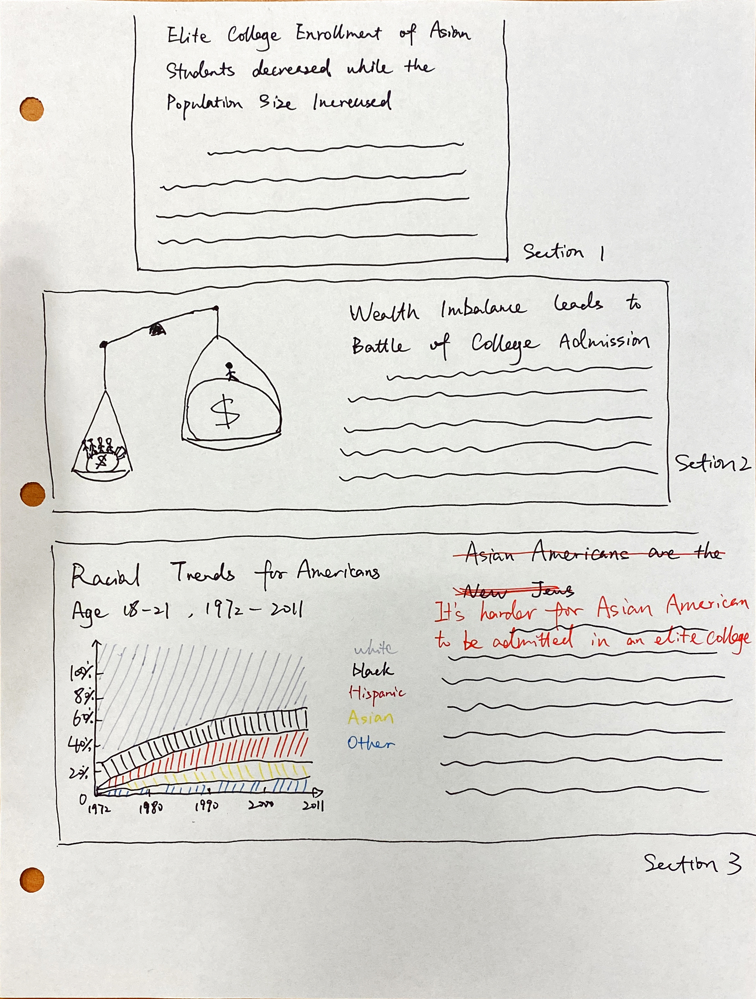

# TSWD Final Project Part II – Asian Quota in Ivy League College Admission
 
In Part I of this final project, I decided to redesign the visualization that Ron Uniz used in his article. 
Also, I plan to tell the story of Asian Quota in Ivy League Colleges from my perspective.
 
For the second part of this project, I first made a wireframe and conducted user research. 
Following that, I revised my outline of this project and edited my wireframe based on the comments from my interviews.
 
## Revised Outline
 
1.	Elite College Enrollment of Asian Students dropped while the population increased
2.	Battle of College Admission Caused by Wealth Imbalance
3.	Asian Americans are the New Jews
4.	Estimating Asian Merit
5.	Jewish Enrollment at Harvard
6.	The Silent Asian
7.	Call of Action
 
## Initial Wireframe

## Research Protocol
 
### Target audience

Since I am planning to raise awareness about education equality by telling a story on the imbalanced college admission. 
My target audience would be people who care about education and especially Asians who live in the United States.
More specifically, a majority of my target audience would be international students 
who plan to live and work in the United States after their graduation. 
The reason is that it would be easier to motivate educated audience about the issue they should care about. 
I hope I can help more people be aware of the inequality around us and motivate 
the silent audience to speak for themselves and their children in the future.
 
### Approach to identify representative individuals to interview
 
My approach to selecting interviewees is straightforward. 
Because Heinz is a diversified college, there are many international students with different backgrounds. 
When I conducted the interview, I walked around in the collaboration space next to A301 
and randomly asked people to take my interview.

 
### Wireframe Research Plan

**Goals/Questions**

Goals|Questions
-----|---------
Is the message I tried to convey clear?|What do you think I am trying to tell?
Is there anything confusing?|
Improve data visualization| How do you think about my data visualizations? How can I improve it?

### Methods
 
5-10 minutes interviews with students I randomly came across in Heinz
Notes
In-person
 
### The Process
 
I randomly picked people that I don’t know at the collaboration space and asked if they would take my interview. I showed the volunteers my wireframes and asked for their feedback. After we finished the conversation, I left contact information if they have any questions or interests to view the final project and thank them for the help.
 
### The script
 

  
**Opening:**
 
Hi, I am doing a project for the Telling Story with Data course. 
Can we do a brief interview on the new page that I designed for a final project? 
My goal is to get some feedback on what’s clear and what is confusing. 
Any comments will be appreciated. And of course it will be anonymous, and the interview will take about 5 to 10 minutes.

Once the interviewee agrees to participate, 
I will hand over the wireframe and wait for a couple of minutes for them to read it. 
Then I will ask the following questions:
 
**What do you think I am trying to tell?
Is there anything confusing?
How do you think about my data visualizations? How can I improve it?
 
**Wrap up
 
Thank you so much for your time and that valuable feedback! Do you have any questions for me?
 
### Interview #1
 
Q: What do you think I am trying to tell?

A: The relationship with the trend of the Asian population and the enrollment rate of the Asian group in the Elite colleges of the U.S.

Q:Is there anything confusing?

A: Whether the circles mean the percentage in the population within the specific year or the absolute number across the time?
   The data does not tell how many schools are included.
   
Q: How do you think about my data visualizations? How can I improve it?

A: I think it’s fine. But more details can be included, such as the source of the data and the labels.

###Interview #2
Q:	What do you think I am trying to tell?

A:	The academic inequality of American elite college admission

Q:	Is there anything confusing?

A:	I don’t understand the meaning behind the graduation hat in the title page

Q:	How do you think about my data visualizations? How can I improve it?

A:	The heading of section 3 might be offensive. I think you should change that.

### Interview #3
Q:	What do you think I am trying to tell?

A:	Asian student is not being treated equally on college admission.

Q:	Is there anything confusing?

A:	It’s hard to tell the trend in the data visualization of section 3.

Q:	How do you think about my data visualizations? How can I improve it?

A:	You can add some labels on the picture of the title page.
 
 
## Findings and Reflections
 
All of the interviewees seemingly understand the first visualization well, 
but it took them quite some time to get the message I tried to convey. 
One possible solution is to label the data on the circles to make the chart more readable.
 
Also, people were having trouble understand the graduation hat picture on the title page. Therefore, 
I should also add more labels on that graph to convey information more directly. 
Moreover, the trend of visualization in section 3 is not apparent; an alternative color scheme or chart type might help.
 
Finally, the heading for section 3 is inappropriate. It might be offensive for some people. 
I should come up with a better and precise title.
 
## Revised Wireframe

